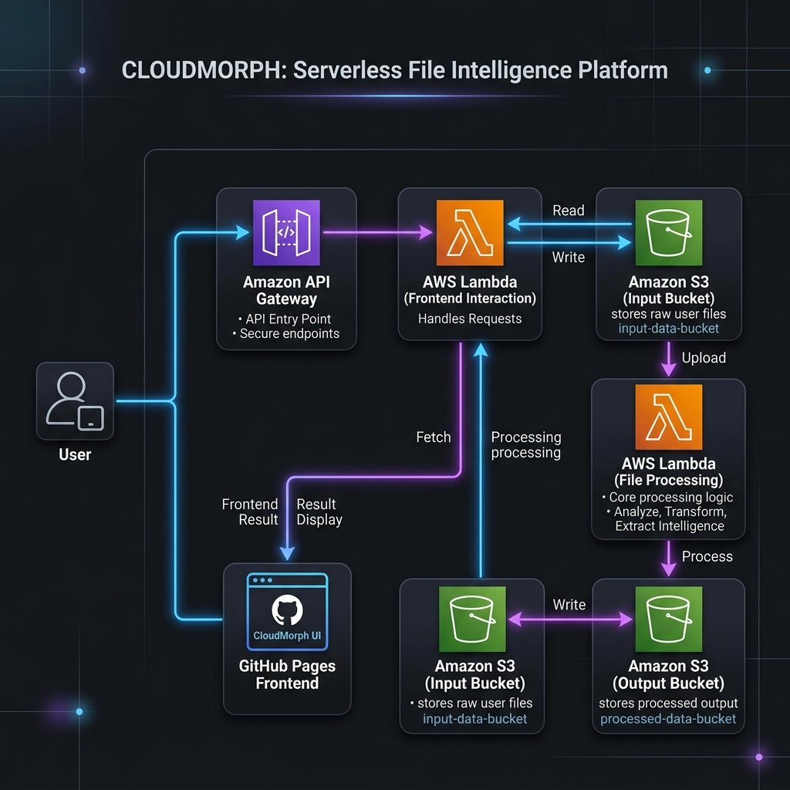

<div align="center">
  
  <h1>🔥 CloudMorph</h1>
  <p><b>Serverless File Intelligence Platform</b></p>
  
  <p>
    
    
    
    
    
    
  </p>
</div>

---

## 🚀 Overview

**CloudMorph** is a modern, production-grade SaaS frontend that demonstrates true serverless cloud architecture. Built with a focus on clean UI/UX and zero-trust security principles, it allows users to securely upload files directly to AWS S3, triggers event-driven Lambda processing, and visualizes extracted insights—all without exposing a single backend credential in the frontend.

### The Problem It Solves
Traditional file processing requires monolithic servers handling uploads, which creates bottlenecks and security risks. **CloudMorph solves this** by leveraging the power of AWS API Gateway pre-signed URLs, allowing secure, direct client-to-cloud uploads, followed by decoupled asynchronous processing.

---

## ✨ Features

- **Direct-to-S3 Uploads:** Utilizes pre-signed URLs to upload files directly from the browser to AWS S3, bypassing traditional backend bottlenecks.
- **Event-Driven Processing:** Automated AWS Lambda triggers for processing uploaded files (PDF, CSV, TXT) immediately upon S3 arrival.
- **Serverless Frontend:** 100% static frontend hosted on GitHub Pages with zero server dependencies.
- **Intelligent Results Dashboard:** Instantly visualizes processed file metrics (word counts, CSV structure, character counts) using a clean JSON data viewer.
- **Modern SaaS Aesthetics:** Glassmorphism UI, smooth micro-animations, and a responsive mobile-first design using Tailwind CSS.
- **Zero-Trust Security:** Absolutely no AWS keys or secrets exist in the frontend code.

---

## 🛠️ Tech Stack

### Frontend Engineering
- **HTML5 & CSS3** (Vanilla + Custom animations)
- **Tailwind CSS** (Rapid UI development & utility classes)
- **Vanilla JavaScript** (ES6+ async/await, Fetch API)
- **FontAwesome** & **Google Fonts (Outfit)**

### AWS Cloud Backend (Integrated)
- **Amazon API Gateway** (REST API)
- **AWS Lambda** (Python/Node.js processing)
- **Amazon S3** (Secure Input & Output Buckets)

---

## 🏗️ Architecture

The entire flow is strictly serverless, event-driven, and horizontally scalable.



---

## ⚙️ How It Works (The Flow)

1. **Get Upload URL:** The frontend sends a `POST` request to the API Gateway with the target filename.
2. **Pre-Signed Generation:** The API Gateway triggers a Lambda that generates a secure, time-bound S3 pre-signed URL and returns it.
3. **Direct Upload:** The frontend `PUT`s the file directly to the S3 Input Bucket using the pre-signed URL.
4. **Event Trigger:** S3 detects the new file and fires an event to the Processing Lambda.
5. **Data Extraction:** The Lambda extracts intelligence from the file and saves a `.json` report in the S3 Output Bucket.
6. **Insight Visualization:** The frontend polls the output destination, fetches the result, and renders a beautiful intelligence dashboard.

---

## 🚀 Installation & Setup

Since CloudMorph is a fully static serverless application, running it locally is instant.

### Local Development
1. Clone the repository:
   ```bash
   git clone https://github.com/kevinjosh10/Cloud-Morph.git
   cd Cloud-Morph
   ```
2. Open `index.html` in your favorite browser. No build steps required.
   *(Optional: Serve via a local server like `npx serve` or Live Server extension in VS Code for a better development experience).*

### GitHub Pages Deployment
This repository is pre-configured to be hosted on GitHub Pages.
1. Go to your repository settings in GitHub.
2. Navigate to the **Pages** section.
3. Select the `main` branch and `/ (root)` folder.
4. Save. Your live site will be available at `https://kevinjosh10.github.io/Cloud-Morph/`.

---

## 🔒 Environment Variables & Security

**Security First:** 
This application adheres to strict security best practices. **No AWS credentials, IAM keys, or sensitive environment variables are stored in the frontend codebase.**
All interactions with the AWS Cloud are securely brokered through an API Gateway acting as a reverse proxy, generating temporary pre-signed URLs to authorize client actions.

---

## 🔮 Future Improvements

While this is a robust V1, here is the roadmap for future enhancements:
- [ ] **AI Summarization Upgrade:** Integrate AWS Bedrock or OpenAI to generate natural language summaries of the uploaded documents.
- [ ] **Authentication System:** Add Amazon Cognito or Firebase Auth to tie uploaded files to specific user accounts.
- [ ] **File History Dashboard:** Persist upload history to DynamoDB and display a historical log of processed files.

---

## 📄 License

This project is licensed under the MIT License - see the LICENSE file for details.

---
<div align="center">
  <i>Designed and developed for the modern cloud.</i>
</div>
